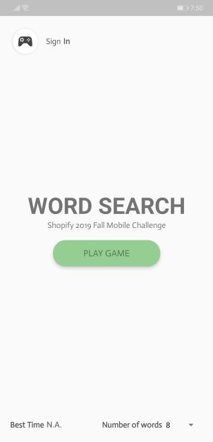
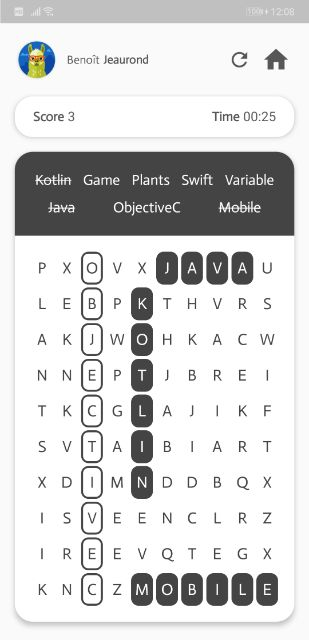
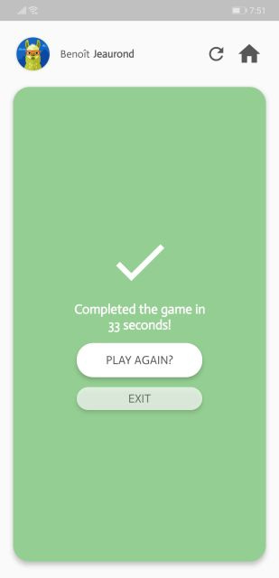
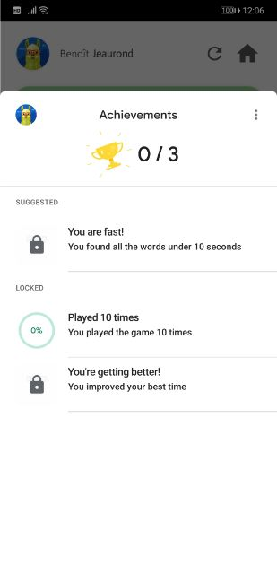
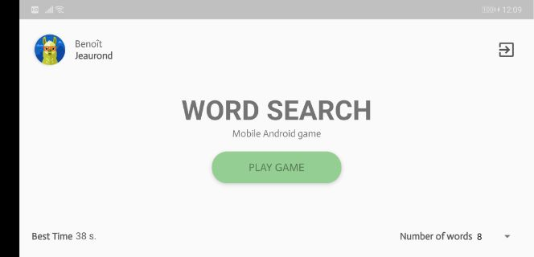
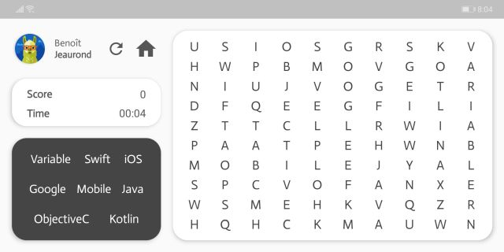
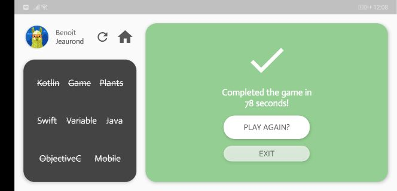
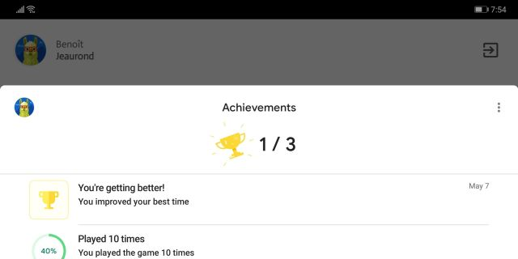

# Word Search
Mobile Android word search game with Google Play Games integration. It creates a word search board randomly every time a new game is started and the user can either click or swipe the letters on the board to find words. It also keeps track of the best time of the user and they can change the number of words to find in the game in the Home screen. Furthermore, you can get some achievements in Google Play Games. This application is responsive and properly responds to orientation events.

__Note:__ For now, to be able to sign in with Google Play Games, the account needs to be part of the tester list for the application. I would need to release the application on the Google Play store to get that feature out for everyone.

## Usage
If you only want to try the application, there is a [.apk](WordSearch.apk) file in which you can run or if you want to modify the code, the code is in this repository.

## Screenshots
Here are the screenshots of the application in both orientation

### Portrait

### Landscape

## Mockups
A quick mockup has been made with Adobe XD before creating the UI in the application. It can be found here https://xd.adobe.com/spec/2111ceb3-5bc2-4a57-6512-773c554c974f-5720/